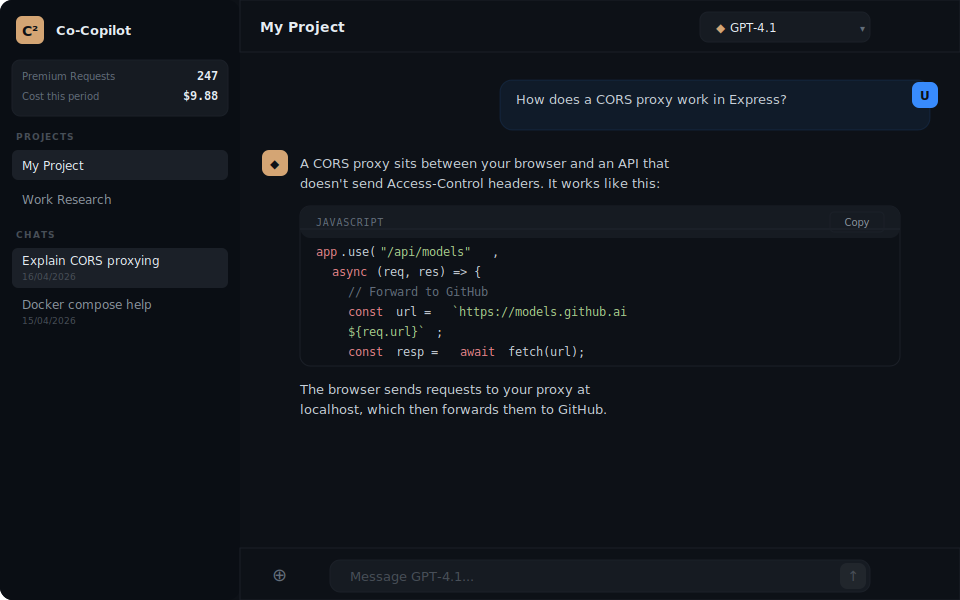
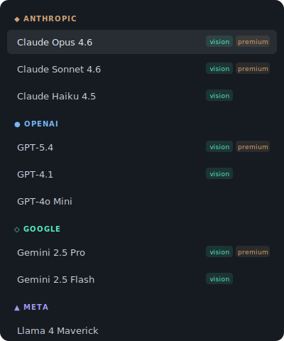
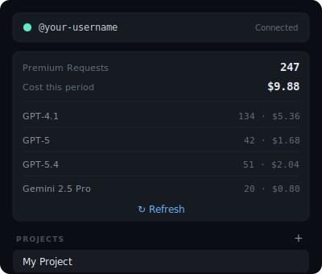
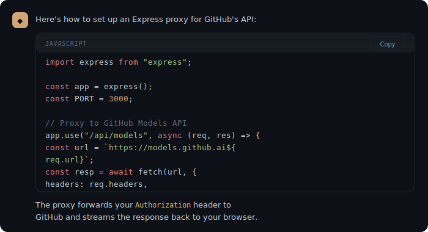
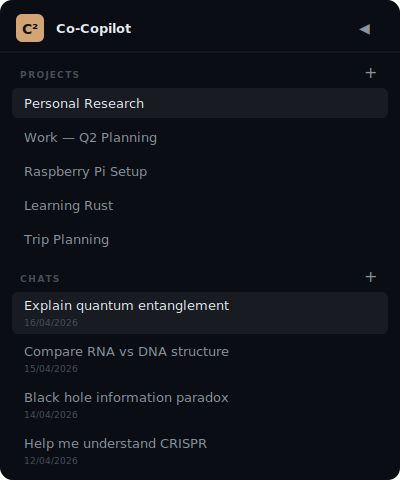

<div align="center">

# Co-Copilot

### Your GitHub Copilot subscription, as a beautiful multi-model chat app

**One chat interface for every model your Copilot plan includes.**
GPT-5, Gemini, Llama, DeepSeek, Grok — all of them, all in one place.

[](LICENSE)
[](https://nodejs.org)
[](docker-compose.yml)
[](https://github.com/RichieLoco/co-copilot/stargazers)

[**Features**](#features) · [**Quick Start**](#quick-start) · [**Deployment**](#deployment) · [**Screenshots**](#screenshots) · [**FAQ**](#faq)

</div>

---

## What is this?

If you pay for **GitHub Copilot Pro or Pro+**, your subscription already includes access to GPT-5, GPT-4.1, Gemini 2.5 Pro, Llama 4, DeepSeek-R1, Grok 3, and more — but only through the VS Code extension or the GitHub website, both of which are built for coding assistance, not general chat.

**Co-Copilot** is a self-hosted web app that gives you a clean, general-purpose chat interface over those same models via the GitHub Models API. Think ChatGPT, but powered by the API access you're already paying for.

<div align="center">



*Main chat interface with model picker, syntax-highlighted code, and persistent project sidebar*

</div>

---

## Features

### 🎯 Every model, one interface
Pulls the full catalog from your Copilot plan dynamically. GPT-5, GPT-4.1, o4-mini, o3, Gemini 2.5 Pro, Llama 4 Maverick, DeepSeek-R1, Grok 3, Mistral, and more — whatever your tier includes, grouped by provider with vision and premium badges.

### 📊 Live usage tracking
A sidebar widget shows your monthly premium request count, total cost, and a per-model breakdown — pulled directly from GitHub's billing API. No more surprise Pro+ bills.

### 📁 Projects & persistent chats
Organise conversations by topic. Create projects, rename them, drag chats between them. Everything persists in browser storage across sessions.

### 🖼️ File & image uploads
Drag and drop anywhere on the window. Images are sent as vision inputs to models that support them; text files are inlined.

### ✨ Beautiful output
Streaming token-by-token responses with syntax-highlighted code blocks (courier-styled, copy button, language labels), proper markdown rendering, and a dark theme that doesn't hurt your eyes at 2am.

### 🔒 Fully self-hosted
No accounts, no telemetry, no third parties. Your token stays in your browser's localStorage, and the included proxy server talks directly to GitHub.

### 🐳 Docker-ready
One-line deploy on your NAS, Raspberry Pi, VPS, or anywhere else you can run Node.js or Docker.

---

## Screenshots

<table>
<tr>
<td width="50%">

<p align="center"><em>Dynamic model picker grouped by provider</em></p>
</td>
<td width="50%">

<p align="center"><em>Premium request usage in sidebar</em></p>
</td>
</tr>
<tr>
<td width="50%">

<p align="center"><em>Syntax-highlighted code with copy button</em></p>
</td>
<td width="50%">

<p align="center"><em>Persistent projects and chat history</em></p>
</td>
</tr>
</table>

---

## Quick Start

### Requirements

- **Node.js 18+** (or Docker)
- **GitHub Copilot Pro or Pro+** subscription
- A **Fine-Grained Personal Access Token** ([how to create one](docs/TOKEN_SETUP.md))

### Development (local machine)

```bash
git clone https://github.com/RichieLoco/co-copilot.git
cd co-copilot
npm install
npm run dev
```

Open http://localhost:5173 and paste your GitHub token when prompted.

### Production (any Linux box, NAS, Pi, VPS)

```bash
# One command with Docker Compose:
docker compose up -d --build

# Or bare-metal Node.js:
npm install && npm run build && npm start
```

Open http://YOUR-SERVER-IP:3000.

> 📚 See [**Deployment Guide**](docs/DEPLOYMENT.md) for detailed instructions on Raspberry Pi, Synology, Unraid, TrueNAS, nginx reverse proxy, HTTPS with Caddy, and more.

---

## Why does Co-Copilot need a proxy server?

GitHub's Models API (`models.github.ai`) doesn't send CORS headers, which means browsers block direct calls to it from anywhere except GitHub's own domain. The included Express server acts as a thin proxy — it sits between your browser and GitHub, forwards your requests with the right headers, and streams chat responses back token-by-token.

**Your token never leaves your browser.** The proxy forwards the `Authorization` header through but never logs or stores it.

---

## Deployment

| Platform | Guide |
|----------|-------|
| 🐳 **Docker / Docker Compose** | [docs/DEPLOYMENT.md#docker](docs/DEPLOYMENT.md#docker) |
| 🍓 **Raspberry Pi** | [docs/DEPLOYMENT.md#raspberry-pi](docs/DEPLOYMENT.md#raspberry-pi) |
| 📦 **Synology NAS** | [docs/DEPLOYMENT.md#synology](docs/DEPLOYMENT.md#synology) |
| 💾 **Unraid** | [docs/DEPLOYMENT.md#unraid](docs/DEPLOYMENT.md#unraid) |
| 🏢 **TrueNAS SCALE** | [docs/DEPLOYMENT.md#truenas](docs/DEPLOYMENT.md#truenas) |
| ☁️ **VPS (Hetzner, DigitalOcean, etc.)** | [docs/DEPLOYMENT.md#vps](docs/DEPLOYMENT.md#vps) |
| 🔒 **Behind HTTPS (nginx / Caddy)** | [docs/DEPLOYMENT.md#https](docs/DEPLOYMENT.md#https) |

---

## Architecture

```
┌──────────────┐          ┌─────────────────────────┐          ┌────────────────┐
│   Browser    │          │  Co-Copilot (port 3000) │          │    GitHub      │
│              │─────────▶│                         │─────────▶│                │
│  React SPA   │   HTTP   │  Express proxy +        │  HTTPS   │  models.github │
│ localStorage │◀─────────│  static file server     │◀─────────│  api.github    │
└──────────────┘          └─────────────────────────┘          └────────────────┘
```

**Front-end:** React 18 + Vite, single-file component, zero runtime dependencies beyond React itself.
**Back-end:** Express proxy (~100 lines), forwards `/api/models/*` to `models.github.ai` and `/api/gh/*` to `api.github.com`.
**Storage:** Browser localStorage — no database required.

See [docs/ARCHITECTURE.md](docs/ARCHITECTURE.md) for a deeper dive.

---

## FAQ

<details>
<summary><strong>Does this work with free GitHub Copilot?</strong></summary>

Partially. Free Copilot has access to a limited set of models and very few premium requests per month. Co-Copilot will work, but you'll hit rate limits quickly. It's really designed for Pro/Pro+ subscribers.
</details>

<details>
<summary><strong>Does my Copilot subscription get charged per message?</strong></summary>

Only if you exceed your plan's monthly premium request allowance. Within your allowance, chat is effectively free. The usage widget in Co-Copilot shows exactly where you stand.
</details>

<details>
<summary><strong>Is this affiliated with GitHub, Microsoft, or Anthropic?</strong></summary>

No. Co-Copilot is an unofficial third-party client that uses GitHub's public Models API. It is not endorsed by or affiliated with GitHub, Microsoft, Anthropic, OpenAI, or any other company.
</details>

<details>
<summary><strong>Why not just use the VS Code extension?</strong></summary>

The VS Code extension is excellent for coding, but it's embedded in an IDE. Co-Copilot is for the times when you want a general chat experience — asking questions, drafting emails, brainstorming, tutoring — without having a code editor in the way.
</details>

<details>
<summary><strong>Can I use this with my organisation's Copilot Business/Enterprise plan?</strong></summary>

The chat functionality works with any valid token. However, the premium request usage widget only works for individually-billed plans — org-billed seats don't expose usage on the user-level API. You'll still see your models, just without the billing widget.
</details>

<details>
<summary><strong>Where are the Claude / Anthropic models?</strong></summary>

Claude models (Sonnet, Opus, Haiku) are available through your Copilot subscription within VS Code and github.com, but Anthropic has **not yet been added to the GitHub Models API** that Co-Copilot uses. This means Claude doesn't appear in Co-Copilot's model picker and can't be used for chat. GitHub has indicated they intend to add Claude to the Models API. When that happens, Claude will appear automatically — no update needed. Track the status [here](https://github.com/eclipse-theia/theia-ide/issues/675).
</details>

<details>
<summary><strong>Does this replace ChatGPT?</strong></summary>

For chat, it can. What it doesn't have (yet): web search, file generation, computer use, custom GPTs, long-term memory, shared conversations. It's a lean chat client, not a full platform.
</details>

<details>
<summary><strong>What happens if I downgrade my Copilot plan?</strong></summary>

The model picker syncs live from GitHub's catalog, so models you no longer have access to simply disappear from the list automatically. No code changes needed.
</details>

---

## Contributing

Contributions are very welcome! Please read [CONTRIBUTING.md](CONTRIBUTING.md) before submitting a PR.

Good first issues are tagged [`good first issue`](https://github.com/RichieLoco/co-copilot/issues?q=is%3Aissue+is%3Aopen+label%3A%22good+first+issue%22). Ideas for enhancement include:

- [ ] Export chats to markdown
- [ ] Keyboard shortcuts (Cmd+K model picker, etc.)
- [ ] Custom system prompts per project
- [ ] Conversation search
- [ ] Theme switcher (light mode / high contrast)
- [ ] Prompt library / saved snippets
- [ ] Voice input / output

---

## License

[MIT](LICENSE) — do whatever you want with it, just don't sue me.

---

## Acknowledgements

- Built with [React](https://react.dev), [Vite](https://vitejs.dev), and [Express](https://expressjs.com)
- Uses the [GitHub Models API](https://docs.github.com/en/rest/models)
- Icon set: simple Unicode geometry — no external dependencies
- Originally prototyped alongside Claude Opus 4.6

---

<div align="center">

**If Co-Copilot saves you time, consider giving it a ⭐ on GitHub.**

[Report Bug](https://github.com/RichieLoco/co-copilot/issues/new?template=bug_report.md) · [Request Feature](https://github.com/RichieLoco/co-copilot/issues/new?template=feature_request.md) · [Discussions](https://github.com/RichieLoco/co-copilot/discussions)

</div>
